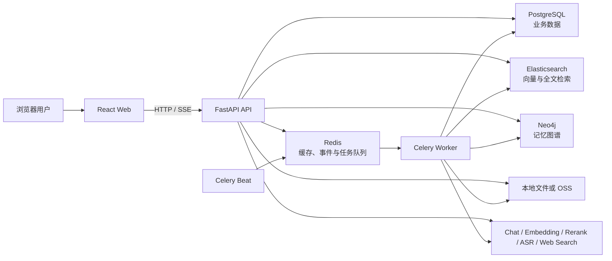
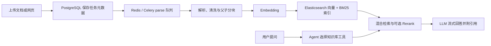
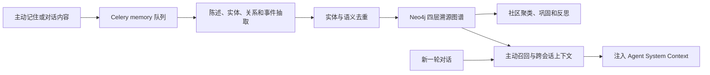
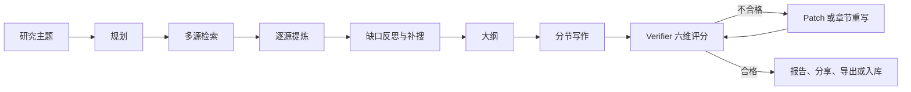

# 现有系统与功能依赖地图

> 状态：Baseline
>
> 分析对象：`lm041520/Comet` 迁入 Meme 的初始代码
>
> upstream 基线提交：`2ae1c07425de51d6891644ff75c9ecfa5b0e6e6e`
>
> 分析日期：2026-08-18

## 1. 系统定位

当前代码是一个多用户个人 AI 知识库与记忆助手，包含知识库 RAG、个人记忆图谱、LLM Agent、深度研究、定时任务、评测与执行追踪等能力。情绪、音乐和多 Agent 群聊的前端体验已退役，相关后端接口、任务和数据暂作为兼容层保留。

它采用前后端分离的模块化单体结构，异步重任务通过 Celery 执行，业务数据和检索数据分布在四类存储中。

## 2. 运行架构



可独立运行的进程包括：

- `web`：React 前端。
- `api`：FastAPI 接口、SSE 流和业务编排。
- `worker`：文档解析、记忆抽取、图片、情绪、音乐和研究任务。
- `beat`：每日回顾、聚类和用户定时任务调度。
- PostgreSQL、Elasticsearch、Neo4j、Redis 四类基础设施。

## 3. 代码分层

后端当前主要采用横向分层：

```text
controller -> service -> repository -> model / database
                         |
                         +-> core domain engine
                         +-> Celery task
```

目录职责：

| 目录 | 当前职责 |
| --- | --- |
| `api/app/controllers` | HTTP 路由、参数接收、鉴权依赖和响应封装 |
| `api/app/services` | 用例编排和事务边界 |
| `api/app/repositories` | PostgreSQL 与 Neo4j 数据访问 |
| `api/app/models` | SQLAlchemy 业务模型 |
| `api/app/schemas` | Pydantic 输入输出模型 |
| `api/app/core` | Agent、RAG、Memory、LLM、存储、安全等核心实现 |
| `api/app/tasks` | Celery 异步任务入口 |
| `api/app/db` | PostgreSQL、ES、Neo4j、Redis 客户端和连接池 |
| `web/src/pages` | 页面级功能 |
| `web/src/api` | 前端接口适配层 |
| `web/src/stores` | Zustand 状态 |

## 4. 功能与代码依赖矩阵

| 功能域 | 前端入口 | 后端入口与核心模块 | 主要数据与外部依赖 | 被哪些功能依赖 |
| --- | --- | --- | --- | --- |
| 账号与资料 | `LoginPage`、`ProfilePage`、`authStore` | `auth_controller/service`、`user_repository`、`security` | PostgreSQL、JWT、bcrypt、文件存储 | 所有需要用户隔离的功能 |
| 模型配置 | `ModelConfigPage` | `model_config_controller/service`、`core/llm` | PostgreSQL、Fernet、第三方模型 API | 对话、RAG、记忆、研究、情绪、音乐 |
| 知识库 | `KnowledgeBasePage`、`KnowledgeDetailPage` | `knowledge_base_*` | PostgreSQL | 文档、图片、对话工具、研究入库 |
| 文档与网页入库 | 知识库详情页 | `document_*`、`core/rag`、`tasks/parse` | PostgreSQL、ES、Redis/Celery、文件存储、Embedding | RAG 对话、搜索、研究 |
| 图片入库与识别 | `ImagePage` | `image_*`、`core/rag/image_*`、`tasks/image` | PostgreSQL、ES、文件存储、多模态 LLM | 搜索、对话附件、知识库 |
| 单人对话 | `ChatPage` | `chat_controller/service`、`core/agent/orchestrator` | PostgreSQL、Redis 事件、LLM | 人格、Skill、工具、记忆、RAG、情绪、Trace |
| 记忆图谱 | `MemoryPage`、`GraphPage` | `memory_*`、`core/memory`、`repositories/neo4j`、`tasks/memory` | PostgreSQL、Neo4j、Celery、LLM/Embedding | 主动召回、跨会话上下文、首页回顾 |
| Agent 工具 | 设置页与对话页 | `core/agent/tools`、`tool_*`、`mcp_*` | 知识库、记忆、Web Search、MCP | 对话、群聊、研究 |
| 人格与 Skills | `AgentConfigPage`、`SkillPage` | `agent_config_*`、`agent_persona_*`、`persona_group_*`、`skill_*` | PostgreSQL、Prompt 模板 | 单聊、群聊、Agent 工具范围 |
| 深度研究 | `ResearchPage` | `research_*`、`core/agent/research` | PostgreSQL、LLM、Web Search、知识库、Redis 事件 | 定时 Agent 任务、报告分享、Verifier Loop |
| Verifier Loop | 研究质量卡片 | `core/agent/loop`、`loop_model` | PostgreSQL、独立 Judge LLM、Trace | 深度研究、定时研究任务 |
| 多 Agent 群聊（后端兼容层） | 无前端入口 | `group_chat_*`、`core/agent/group_chat` | PostgreSQL、Redis 事件、LLM、人格、工具 | 分享邀请、真人模式 |
| 定时 Agent 任务 | `AgentTaskPage` | `agent_task_*`、`tasks/agent_task`、`tasks/beat` | PostgreSQL、Redis/Celery、研究引擎 | 研究报告、任务历史、首页简报 |
| 情绪系统（后端兼容层） | 无前端入口 | `emotion_*`、`core/emotion`、`tasks/emotion` | PostgreSQL、Celery、LLM | 音乐推荐、每日回顾、对话后台任务 |
| 音乐（后端兼容层） | 无前端入口 | `music_*`、`core/music`、`tasks/music` | PostgreSQL、文件存储、LLM、咪咕接口 | 情绪推荐、播放历史 |
| 搜索、标签、收藏 | `SearchPage`、`FavoritesPage` | `search_*`、`tag_*`、`favorite_*` | PostgreSQL、ES、Neo4j | 导航和内容管理 |
| 首页与每日回顾 | `HomePage` | `dashboard_*`、`daily_review_service`、`tasks/beat` | PostgreSQL、Neo4j、LLM、Celery | 记忆、情绪、定时任务 |
| 分享与导出 | `SharePage`、`ReportSharePage` | `conversation_share_*`、`report_share_*`、`core/export` | PostgreSQL、文件存储 | 对话、研究报告 |
| Trace 与成本 | `TracesPage` | `trace_*`、`core/agent/tracing` | PostgreSQL、模型价格配置 | 对话、研究、Verifier、面试展示 |
| 离线评测 | 无产品页面 | `api/eval`、`api/tests` | 测试数据、ES/Embedding/LLM（按任务） | RAG、记忆和 Verifier 质量证明 |

## 5. 关键业务链路

### 5.1 文档入库与问答



### 5.2 记忆写入与主动召回



### 5.3 深度研究与质量闭环



## 6. 依赖层级

```text
L0 基础设施
   config / logging / exceptions / response / security / request context
   PostgreSQL / Redis / ES / Neo4j / storage

L1 平台能力
   auth / model config / LLM resolver / Celery / realtime event bus

L2 核心领域
   knowledge + document + image + RAG
   memory + graph + retrieval
   conversation

L3 Agent 编排
   tools / personas / skills / MCP / tracing

L4 扩展体验
   research / verifier / group chat backend compatibility / scheduled tasks
   emotion/music backend compatibility / sharing / dashboard / favorites
```

删除或替换模块时，应从 L4 向下检查依赖，不能直接移除 L0-L2 公共能力。

## 7. 高耦合点与重构风险

### ChatService 是主要汇合点

`chat_service.py` 同时协调会话持久化、SSE、Agent、工具、人格、Skill、记忆主动召回、图片附件、情绪后台任务和 Trace。删除记忆、情绪或 Skill 时，都必须同步处理这里的调用和降级行为。

### 模型配置是横向公共依赖

Chat、Embedding、Rerank、视觉、ASR、Web Search 和 Judge 模型共享模型配置体系。简化配置页不能破坏各模型类型的解析和默认模型选择。

### 异步任务与产品状态绑定

文档、图片、记忆、研究和定时任务均包含“等待、处理中、成功、失败、重试”等状态。移除 Celery 或队列时不仅影响执行，还会影响数据库状态机和前端轮询/SSE。

### 四种存储不是可互换副本

- PostgreSQL 保存业务事实和任务状态。
- Elasticsearch 保存可重建的检索索引。
- Neo4j 保存记忆关系图和事件结构。
- Redis 保存队列、缓存和短期事件。

任何基础设施精简都需要先定义数据所有权和重建策略。

### 路由注册是全量静态导入

所有 controller 当前集中注册在 `controllers/router.py`。直接删除文件会导致应用启动失败；隐藏功能应先采用导航隐藏或显式模块开关，再处理路由、模型、迁移和任务。

## 8. 功能变更影响检查表

删除或重设计一个功能时，至少检查：

- 前端路由、菜单、页面、Store 和 API 封装。
- Controller、Schema、Service、Repository 和 Model。
- `controllers/router.py` 的路由注册。
- Celery task route、beat schedule 和后台投递点。
- Alembic 历史与新迁移策略；不得改写已发布迁移。
- PostgreSQL 表、ES 索引、Neo4j 节点关系和 Redis Key。
- 环境变量、Docker 服务、文件卷和第三方 API。
- 与 ChatService、Dashboard、Search、Trace 的交叉调用。
- 测试、评测数据、README 和演示脚本。

## 9. 当前结论

现有代码具备较强的 AI 工程展示价值，但功能面超过一个面试作品首版所需范围。后续应保留完整基线，通过“先隐藏、再解耦、后删除”的顺序收敛产品，避免一次性删代码造成无法启动或数据迁移失控。
