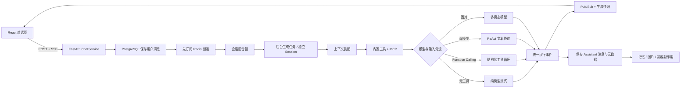

# 对话与 Agent 工具编排：可恢复、可观测的流式执行闭环

> 文档状态：基于 2026-08-26 的 `main` 当前实现。产品范围见 [ADR-0001](../decisions/0001-product-scope.md)，系统全貌见 [CURRENT-SYSTEM.md](../architecture/CURRENT-SYSTEM.md)，目标边界见 [TARGET-ARCHITECTURE.md](../refactor/TARGET-ARCHITECTURE.md)。

## 1. 核心亮点

Meme 的对话模块不只是把模型输出转成 SSE，而是把会话持久化、上下文装配、工具选择、模型能力分流、实时事件、断线恢复和回答后副作用组织成一个统一的 Agent 执行管线。

### 简历表述

设计并实现可恢复、可观测的流式 Agent 对话管线：将模型生成与客户端 SSE 连接解耦，通过 Redis Pub/Sub、回合锁和生成缓冲支持切页或断线后的续传及最终落库；构建统一工具注册与事件协议，按模型能力在原生 Function Calling 和 ReAct 之间分流，接入知识库、长期记忆、联网搜索及 MCP，并记录工具状态、来源引用、耗时和 Trace，使 Agent 执行过程具备范围控制、失败降级和过程解释能力。

### 一分钟讲解

用户发送消息后，系统先校验会话归属并把用户消息写入 PostgreSQL，然后先订阅 Redis 频道，再启动独立的后台生成任务。SSE 连接只负责转发事件，因此用户切换页面或网络短暂中断时，模型仍可继续执行、保存回答并派发后续任务。生成中的累计文本、引用、工具调用和 Trace ID 会周期性写入 Redis，前端重新进入会话时可以先恢复快照，再继续接收新事件。

真正执行前，系统会装配当前人格、可选 Skill、当前时间、长期记忆、跨会话背景、最近 20 轮历史和临时附件，并根据用户配置及本轮范围构建工具。如果模型声明支持 Function Calling，就让模型输出结构化工具调用；否则用 ReAct Prompt 兼容只会生成文本的模型。两条路径最终都转成 `tool_start`、`tool_result`、`token`、`citation` 和 `done` 等统一事件，前端据此展示真实工具状态，而不是向用户暴露模型的内部推理文本。

为避免无限循环，单轮最多执行 5 次“模型—工具”迭代，相同工具和参数在本轮内复用结果；工具失败会作为 Observation 回灌，让模型尝试给出降级回答。最终回复连同引用、工具调用和 Trace ID 一起落库，记忆萃取、图片入库等非关键副作用失败时不会阻断回答。

这套实现已经覆盖流式 Agent 的主要工程链路，但还没有达到消息队列级的精确一次续传，也缺少完整的工具授权策略和模型感知的上下文预算。面试时应把它描述为“具备恢复与降级能力”，而不是“绝不会丢事件的生产级执行引擎”。

## 2. 为什么对话 Agent 不只是调用一次模型

一个面向真实用户的 Agent 回合要同时处理多种问题：

- 用户刷新页面或切换会话时，模型生成不应立即被取消并丢失回答。
- 同一会话重复发送时，不能轻易触发两个并发回答。
- 模型可能支持原生工具调用，也可能只能输出普通文本。
- 知识库、记忆、联网和外部 MCP 工具具有不同配置与失败模式。
- 人格、历史、附件、长期记忆和跨会话内容都要进入有限的上下文窗口。
- 工具结果、来源引用和 Trace 要与最终消息建立关联。
- 记忆萃取、图片处理等后台工作不能拖慢首字时间或影响主回答。
- 前端需要展示真实执行阶段，但不应把模型内部思考直接当作产品内容。

因此 Meme 将一次对话拆成“接受请求、持久化、上下文装配、Agent 执行、事件转发、结果落库、异步副作用”七个阶段，而不是把所有工作塞进一个 HTTP 请求函数。

## 3. 总体架构



PostgreSQL 保存最终会话事实，Redis 负责生成期间的临时协调和广播。两者不是互为副本：Redis 缓冲过期或 API 进程退出时，最终应以已经落库的消息为准。

## 4. 一轮对话如何执行

### 4.1 先保存用户消息

请求进入后，系统会：

1. 校验 `conversation_id` 是否属于当前用户；没有则按问题前 20 个字符创建新会话。
2. 保存用户文本、临时附件元数据和图片 Key。
3. 返回 `meta` 事件，让前端获得真实会话 ID 和标题。
4. 更新完成后才进入模型生成。

用户消息先落库的好处是，即使模型调用失败，用户提问仍然可恢复和排查。代价是如果后台任务在产生任何回复前永久失败，会话可能暂时停留在“最后一条是用户消息”的状态，需要重试或补偿。

### 4.2 先订阅，再触发生成

ChatService 先打开 Redis Pub/Sub 订阅，再尝试获取会话回合锁并启动后台任务。这个顺序用于避免模型第一个 Token 早于订阅建立而丢失。

后台任务使用独立 SQLAlchemy Session，不依赖最初请求的数据库连接。客户端断开只会结束当前 SSE 转发，不会直接取消后台任务。生成结束后，后台任务保存 Assistant 消息，清理临时缓冲，最后发布 `done`。

### 4.3 统一事件协议

当前主要事件如下：

| 事件 | 作用 |
| --- | --- |
| `meta` | 返回会话 ID 和标题 |
| `trace` | 尽早返回本回合 Trace ID |
| `token` | 增量回答文本 |
| `tool_start` | 工具名称和查询参数 |
| `tool_result` | 工具状态、结果预览、统计和耗时 |
| `citation` | 回答使用的知识库来源 |
| `resume` | 断线后恢复累计文本、工具、引用和 Trace |
| `idle` | 当前没有正在生成的回合，前端可重拉历史 |
| `done` | 回答已落库，返回消息和 Trace ID |
| `error` | 本回合失败 |

前端使用真实事件派生“理解问题、调用工具、汇总信息、生成回答”等状态。它不会把 ReAct 的 `Thought` 或模型隐藏推理展示给用户；历史消息只保存回答、工具调用摘要、引用和 Trace ID。

## 5. 上下文装配

### 5.1 当前装配顺序

一次普通文本对话大致装配为：

```text
当前生效人格 Prompt 与温度
  → 可选 Skill Prompt 与 few-shot
  → 当前北京时间和时效性工具提示
  → 主动召回的长期记忆
  → 可选跨会话背景
  → 可选真人聊天风格
  → 最近 20 轮会话历史
  → 当前问题与临时附件全文
```

人格负责“以什么身份和风格回答”，Skill 负责“这一轮完成什么专项任务”。Skill 可以附加 Prompt、few-shot、内置工具白名单和一个知识库范围，因此它不是另一套 Agent，而是一组对当前回合的约束。

### 5.2 历史、记忆和跨会话的区别

| 上下文 | 当前来源 | 主要作用 |
| --- | --- | --- |
| 当前会话历史 | PostgreSQL 最近最多 40 条消息 | 保持本会话连续性 |
| 主动记忆 | Neo4j 检索结果与进程内温热缓存 | 提供稳定的用户画像和长期事实 |
| 跨会话背景 | 最近最多 3 个其他会话、每个最多 4 轮，总计 1200 字符 | 衔接尚未萃取成长期记忆的近期话题 |
| 临时文档附件 | 请求及消息元数据中的解析文本 | 让模型直接阅读，不进入知识库索引 |

主动记忆首次同步获取，后续先注入用户级缓存，并在实质问题后后台刷新。这样降低首字延迟，但缓存位于单个 API 进程内，没有 TTL，也可能在多 Worker 间短期不一致。

### 5.3 临时文档与图片分流

临时文档支持 PDF、DOCX、Markdown、TXT 和 HTML，解析后每份截取前 10000 个字符。文本不进入知识库，但会随用户消息保存在 PostgreSQL 元数据中，并在最近历史窗口内重新注入，便于后续追问。

图片最多取 4 张，读取后压缩并转成 Base64，交给用户配置的多模态模型。图片路径当前不进入工具编排，因此同一轮不能同时让多模态模型调用知识库、记忆、联网或 MCP；回答后图片会尝试异步纳入图片库。

### 5.4 当前上下文限制

- 系统按固定轮数和字符数裁剪，没有依据具体模型上下文窗口计算 Token 预算。
- 历史只恢复用户与 Assistant 最终文本，不恢复上一轮的 ToolMessage 和完整工具证据。
- 临时附件限制单份输出字符数，但上传前会先把整个文件读入内存，也没有请求级附件总量上限。
- 用户请求正文没有显式最大长度，多个附件叠加后可能超过模型上下文。
- 当前聊天实际使用激活人格的 Prompt 和温度；`AgentConfig` 中遗留的 `system_prompt`、`temperature` 和旧工具开关已经不再是主要执行来源，模型注释与实际代码存在漂移。

后续应引入统一的 `ContextBuilder`：按模型 Token 上限给人格、记忆、历史、附件和工具描述分配预算，并记录每部分被截断的原因。

## 6. 工具注册与范围控制

### 6.1 内置工具

内置工具通过 `ToolSpec` 声明名称、描述、参数 Schema、构建器、配置依赖和默认开关。目前注册了：

- 知识库检索。
- 长期记忆检索。
- 联网搜索。
- 当前时间。
- 创建定时研究任务。

工具定义保存在代码中，用户启停状态保存在 PostgreSQL。构建某个工具失败时只跳过该工具，不让整个 Agent 无法启动；联网搜索没有配置 Provider 时也不会加入工具列表。

### 6.2 当前实际优先级

按代码当前执行顺序，内置工具开关优先级是：

```text
Skill 工具白名单
  > 本轮知识库 / 记忆 / 联网临时开关
  > 用户持久工具配置
  > ToolSpec 默认值
```

这与部分代码注释中“本轮临时开关最高”的描述不一致。例如 Skill 白名单包含联网工具时，可能覆盖本轮关闭联网的请求。该优先级应在后续重构中显式建模并增加测试，不能只依赖字典覆盖顺序。

知识库范围单独计算：Skill 绑定知识库时只检索该库，否则检索用户开启 `chat_enabled` 的知识库集合。知识库和记忆工具内部还会强制使用当前用户 ID，工具描述不能替代数据层隔离。

### 6.3 MCP 扩展

用户可以配置远程 SSE 或 Streamable HTTP MCP Server。当前实现会：

- 对 Bearer Token 或 API Key 加密入库，接口只返回掩码。
- 拒绝明显的内网、回环和特殊地址，降低 SSRF 风险。
- 并行加载多个 Server，单个失败或超时不影响其他工具。
- 清洗工具名并添加 Server 前缀，满足 Function Calling 命名限制和去重要求。
- 使用 5 分钟进程内缓存，Server 配置变化时主动失效。

当前聊天使用无状态 MCP 工具构建路径。缓存命中时可以省去重复拉取工具清单，但工具执行仍可能产生新的连接成本；代码中已有持久会话版本，主聊天链路尚未采用。

Skill 白名单目前只遍历内置工具，已启用的 MCP 工具仍会被追加。因此 Skill 不是完整的工具沙箱。系统也没有为有副作用的 MCP 工具提供逐次确认、参数预览和风险等级，不能把“用户启用了 Server”等同于“模型可以安全执行它的任何操作”。

## 7. 双路径 Agent 编排

### 7.1 原生 Function Calling

模型配置包含 `function_call` 能力标记时，系统使用 `bind_tools`：

1. 流式调用模型并收集结构化 `tool_calls`。
2. 没有工具调用时，把本轮内容作为最终回答。
3. 有工具调用时，发布开始事件并按顺序执行工具。
4. 把 ToolMessage 回灌到消息列表，再调用下一轮模型。
5. 最多循环 5 次。

同一回合内，相同工具和完全相同参数会复用上一次结果，减少重复检索、MCP 握手和外部费用。工具异常被转换为错误 Observation，模型仍有机会解释失败或基于已有信息作答。

当前多个工具调用是顺序执行，没有分析依赖后并行运行。模型能力也由用户配置中的标记决定，没有在保存配置时进行真实 Function Calling 探测；标记错误会把模型送入不合适的执行路径。

### 7.2 ReAct 兼容路径

不支持 Function Calling 的模型会收到文本协议，按 `Thought / Action / Action Input / Final Answer` 输出。系统用正则提取一个工具名称和一行查询，执行后把 Observation 作为新消息回灌。

这条路径扩大了兼容模型范围，但能力弱于原生调用：

- 每次模型调用使用非流式 `ainvoke`，最终答案通常作为一个 SSE 文本块返回，不是真正逐 Token。
- 文本格式容易受模型遵循度影响，正则解析比结构化参数脆弱。
- 只为工具传递单个 `query`，不能可靠调用需要多个结构化字段的复杂工具。
- ReAct Prompt 包含 `Thought`，但当前服务只解析它，不把中间思考发送或保存到用户界面。

### 7.3 循环终止和降级

两条路径都限制最多 5 轮工具循环，并为同参调用设置回合内缓存。如果达到上限仍未收敛，Function Calling 路径返回已经生成的文本或兜底提示，ReAct 路径返回“多轮工具调用后仍未得到结论”。

固定轮数是简单有效的安全阀，但没有同时约束总 Token、总耗时、外部费用和单工具调用次数。更完整的执行预算应统一考虑轮数、Token、时间、成本及副作用风险。

## 8. 流式恢复与一致性

### 8.1 当前恢复机制

后台任务累计生成文本，并每 8 个流式文本块刷新一次 Redis 快照。快照包含文本、文本块序号、引用、工具调用、状态和 Trace ID，过期时间为 600 秒。重新进入会话时：

1. 先校验会话属于当前用户。
2. 建立 Redis 订阅。
3. 二次读取生成快照，确认任务仍在运行。
4. 发送 `resume` 快照。
5. 跳过快照已覆盖的 Token，继续转发新事件。
6. 如果任务已经结束，发送 `idle`，前端按需重新拉取 PostgreSQL 历史。

前端会把快照恢复成临时 Assistant 气泡，继续追加 Token 和工具状态；收到 `done` 后替换为真实消息 ID。

### 8.2 当前不等于精确一次

Redis Pub/Sub 不保存历史事件，快照又是批量刷新，因此断线发生在两次刷新之间时，极端情况下可能漏掉尚未进入快照的少量 Token 或最新工具状态。最终完整回答已经落库时，重新拉取历史可以修复显示，但当前 `done` 后不一定立即强制校准整条消息。

会话回合锁使用 Redis `SET NX EX`，租约为 120 秒，没有续租和锁拥有者 Token。超长生成可能让锁提前过期；旧任务结束时也可能误删后来任务获取的同名锁。Redis 异常时当前策略是保守放行，因此允许偶发重复生成而不是阻塞对话。

后台生成任务仍运行在 API 进程内。SSE 断开不会取消它，但 API 进程重启会使任务消失；Redis 快照只能恢复输出，不能恢复模型和工具执行状态。因此当前保证的是连接级恢复，不是进程级持久执行。

生产化方案可以使用带消费位置的 Redis Streams 或持久任务队列、带所有者和续租的分布式锁、事件序号及最终消息校准，实现可重放和幂等消费。

## 9. 持久化、失败隔离与安全

### 9.1 消息与副作用

回答完成后，Assistant 消息会保存：

- 最终文本。
- 来源引用。
- 工具调用、状态、统计、耗时和最多 600 字结果预览。
- Trace ID。

随后系统尝试派发记忆萃取、聊天图片入库和情绪分析。每项失败只记录日志，不影响已经生成的回答。情绪功能已在产品 ADR 中确认删除，但当前 ChatService 仍会派发兼容任务，说明模块边界尚未完全收敛。

如果生成中途异常，只要已经产生文本，系统会保存带 `interrupted=true` 的部分回答。重新生成目前先删除旧 Assistant 消息，再开始新回合；如果新回合在产生任何文本前失败，旧回答已经不存在。更安全的方案是先生成新版本，成功后再切换当前版本。

### 9.2 用户隔离

- 会话查询、重连、重命名、删除和消息列表均先校验当前用户归属。
- 反馈和重新生成先定位消息，再校验其会话属于当前用户。
- 知识库、记忆、Skill、人格和 MCP 配置查询都带用户 ID。
- 模型及 MCP 密钥加密保存，接口不返回明文。

### 9.3 仍需加强的风险

- MCP、网页、知识库和临时附件内容都属于不可信输入，当前没有统一的 Prompt Injection 隔离与工具输出信任标记。
- 有副作用的工具没有统一的确认策略、权限等级和审计协议。
- 对话文档上传缺少文件字节大小上限，图片上传也需要更严格的 MIME、大小和内容校验。
- 工具结果预览会进入消息元数据和 Trace，应增加敏感字段脱敏、保留期限和最大存储预算。
- Skill 的 `enabled` 状态在按 ID 加载时未作为执行条件校验，且主对话页当前固定发送 `skill_id=null`，后端能力尚未形成完整产品入口。
- 创建定时任务工具默认注册为开启，但定时任务页面当前按产品决策隐藏，工具能力与产品表面需要进一步统一。

## 10. 当前限制与后续重构

当前最值得优先处理的不是增加更多工具，而是收敛执行边界：

1. **拆分 ChatService。** 提取 `ContextBuilder`、`TurnRunner`、`StreamCoordinator` 和 `PostTurnDispatcher`，让各部分可独立测试。
2. **统一上下文预算。** 按模型 Token 上限分配人格、工具、历史、记忆、附件和回答空间，并记录截断原因。
3. **显式工具策略。** 统一 Skill、本轮开关、持久配置和 MCP 的优先级，引入只读、可写、危险操作分级与用户确认。
4. **增强执行预算。** 同时限制迭代数、Token、耗时、费用和外部调用次数。
5. **升级事件可靠性。** 使用可重放事件流、单调序号、消息校准和带续租的所有者锁。
6. **收敛模型能力。** 保存模型配置时探测 Function Calling、流式 Usage 和多模态能力，不完全依赖人工标记。
7. **清理遗留耦合。** 移除已删除功能的对话后副作用，明确 AgentConfig、人格和工具配置的单一事实来源。
8. **补充自动化测试。** 覆盖工具优先级、循环上限、重复调用缓存、断线竞态、并发回合、部分失败和用户越权。

建议演进顺序：

```text
配置与权限单一事实来源
  → ContextBuilder 与执行预算
  → 可重放事件和锁租约
  → ChatService 副作用拆分
  → Tool Policy 与高风险确认
  → 端到端回归和故障注入
```

## 11. 高频面试问题与参考回答

### Q1：请完整介绍一轮 Agent 对话的执行过程

**参考回答：** 请求进入后先校验或创建会话并保存用户消息，再先建立 Redis 订阅、获取会话回合锁，然后启动使用独立数据库 Session 的后台生成任务。任务装配人格、时间、记忆、跨会话背景、历史和附件，按配置构建工具，并根据模型能力进入纯模型、Function Calling、ReAct 或多模态路径。执行过程统一产生 Token、工具、引用和 Trace 事件，通过 Redis 转给 SSE；完成后保存 Assistant 消息并异步派发记忆和图片等副作用。

### Q2：为什么要把模型生成与 SSE 连接解耦？

**参考回答：** 如果模型协程直接运行在浏览器的 SSE 请求中，用户刷新、切页或网络抖动可能取消任务，已经消耗的模型费用和工具结果也会丢失。Meme 让后台任务独立执行，SSE 只订阅事件，因此断开不影响最终落库。代价是需要额外处理事件缓冲、重连、锁和进程故障，不能只依赖普通生成器。

### Q3：当前断线续传能保证一个 Token 都不丢吗？

**参考回答：** 不能这样承诺。当前使用 Redis Pub/Sub 加每 8 个流式文本块刷新的快照，能覆盖常见切页和短暂断线，但 Pub/Sub 不可重放，刷新间隙仍可能缺少少量事件。完整回答落库后重新拉历史可以恢复。生产化会使用带序号的持久事件流、客户端游标和最终消息校准，做到可重放和幂等渲染。

### Q4：为什么同时实现 Function Calling 和 ReAct？

**参考回答：** 原生 Function Calling 参数结构稳定，适合复杂工具，也是首选路径；但用户可能配置不支持工具协议的 OpenAI 兼容模型，所以保留 ReAct 作为降级。ReAct 通过文本格式解析单个 Action，兼容性更广，但非真正流式、参数能力有限且更依赖模型遵循度，因此不应该把两条路径描述成同等可靠。

### Q5：如何避免 Agent 无限调用工具？

**参考回答：** 当前最多循环 5 次，并缓存本轮相同工具和相同参数的结果；工具异常作为 Observation 回灌，让模型有机会降级。如果达到上限就停止并返回已有内容或兜底信息。下一步会增加总 Token、总时长、费用和副作用次数预算，因为只限制轮数无法控制一次昂贵工具调用。

### Q6：工具最终是否可用由什么决定？

**参考回答：** 内置工具来自代码注册表，基础开关来自用户持久配置，本轮请求可以覆盖知识库、记忆和联网开关，Skill 又能设置内置工具白名单，知识库范围还受 Skill 绑定或 `chat_enabled` 控制。MCP Server 单独按用户启用后追加。当前 Skill 白名单与 MCP 没有形成完整统一策略，优先级也有注释和代码不一致，所以我会把它重构成显式 Tool Policy 并用参数化测试固定规则。

### Q7：接入 MCP 时最重要的安全问题是什么？

**参考回答：** 不能只关注连接成功。要保护认证密钥和用户隔离，限制出站 URL，防止工具名冲突，并把 Server 返回内容视为不可信数据。更重要的是区分只读和有副作用工具，对写操作展示参数、要求确认并记录审计。Meme 已有密钥加密、掩码、基础 SSRF 检查、超时和故障隔离，但还缺少完整的运行时授权和 Prompt Injection 防护。

### Q8：上下文越来越长时怎么处理？

**参考回答：** 当前只限制最近 20 轮、跨会话 1200 字符和单份临时附件 10000 字符，尚未按具体模型计算 Token。更合理的做法是先预留回答和工具调用空间，再为系统指令、记忆、历史、附件分配预算；历史可以做滚动摘要，检索内容按相关性去重，并记录截断原因。这样才能同时控制成本、时延和信息损失。

### Q9：前端显示“正在理解”是不是暴露了 Chain of Thought？

**参考回答：** 不是。前端状态来自 `tool_start`、`tool_result`、首个 Token 和 `done` 等真实系统事件，只表达执行阶段。ReAct 模型虽然按 Prompt 生成 Thought，但服务只解析它，不把中间推理发送或持久化。产品应该展示可验证的工具、来源和状态，而不是模型内部推理文本。

### Q10：这个模块下一步最优先重构什么？

**参考回答：** 我会先统一配置和工具权限的事实来源，再提取 ContextBuilder 和流式协调器。原因是当前 AgentConfig、人格、工具配置和 Skill 之间存在语义漂移，ChatService 还承担记忆、图片和已计划删除功能的副作用。边界明确后，再升级可重放事件、锁租约和故障注入测试，避免在高耦合代码上继续增加工具。

## 12. 面试演示路径

1. 新建会话，发送一个无需工具的常识问题，展示纯流式回答。
2. 提问演示知识库中的事实，展示工具开始、命中统计、结果预览和来源引用。
3. 提问个人信息，展示长期记忆工具或主动记忆上下文的作用差异。
4. 启用联网搜索后询问时效问题，说明当前北京时间提示如何引导模型使用实时工具。
5. 在回答生成中刷新页面或切换会话，再返回观察 `resume` 续传和最终消息落库。
6. 点击回答下方的执行轨迹入口，说明 Trace ID 如何与本轮消息绑定；详细可观测性留到下一模块讲解。
7. 展示工具配置和 MCP Server 页面，说明持久开关、连接测试、密钥掩码及当前审批边界。
8. 主动说明 ReAct、上下文预算和 Pub/Sub 续传限制，并给出重构方案。

演示重点是“一个回合如何被可靠地组织和解释”，而不是展示工具数量。

## 13. 代码与验证入口

### 会话与流式协调

- [ChatService](../../api/app/services/chat_service.py)：回合入口、上下文装配、后台生成、续传和副作用。
- [对话路由](../../api/app/controllers/chat_controller.py)：会话接口、SSE、附件、多模态和反馈入口。
- [Redis 实时总线](../../api/app/core/realtime/bus.py)：Pub/Sub、心跳、生成快照和回合锁。
- [会话数据访问](../../api/app/repositories/conversation_repository.py)：用户隔离、最近历史和消息持久化。
- [会话模型](../../api/app/models/conversation_model.py)：消息内容及引用、工具和 Trace 元数据。

### Agent 与工具

- [Agent 编排器](../../api/app/core/agent/orchestrator.py)：Function Calling、ReAct、循环上限和回合缓存。
- [工具注册中心](../../api/app/core/agent/tools/registry.py)：持久开关、临时覆盖、内置工具和 MCP 装配。
- [工具协议](../../api/app/core/agent/tools/base.py)：`ToolSpec` 与 `ToolBuildContext`。
- [ReAct Prompt](../../api/app/core/agent/prompts/react.jinja2)：弱模型文本工具协议。
- [MCP 加载器](../../api/app/core/agent/tools/mcp/loader.py)：并行加载、名称清洗、超时和缓存。
- [MCP 连接安全](../../api/app/core/agent/tools/mcp/connection.py)：认证解密和基础 SSRF 检查。
- [Skill 模型](../../api/app/models/skill_model.py)：Prompt、工具白名单、知识库绑定和 few-shot 配置。

### 前端与验证

- [对话页面](../../web/src/pages/ChatPage.tsx)：发送、续传、附件和消息状态管理。
- [SSE 客户端](../../web/src/api/chat.ts)：事件解析及回调协议。
- [工具过程组件](../../web/src/pages/chat/ChatProcess.tsx)：基于真实事件的阶段和工具详情展示。
- [Trace 可靠性测试](../../api/tests/test_trace_reliability.py)：Trace 持久化及 `trace`、`resume` 事件转发回归。
- [核心演示清单](../testing/CORE-DEMO-FLOW.md)：单人流式对话、工具引用和 Trace 的人工验证步骤。

当前自动化测试只覆盖了 Trace 主记录和部分 SSE 转发，尚未充分覆盖 Agent 循环、工具优先级、Redis 竞态及进程故障。文档中的这些限制应转化为后续测试 Issue，而不是被“已有测试”概括掉。

## 14. 讲解边界

面试中可以确定地说：

- 已实现单人会话持久化、SSE 流式事件和连接级断线恢复。
- 已实现 Function Calling 与 ReAct 双路径、统一工具事件和最多 5 轮执行保护。
- 已接入知识库、记忆、联网、时间、定时任务及远程 MCP 工具。
- 已实现人格、长期记忆、跨会话背景、附件和历史的上下文装配。
- 已把引用、工具统计、耗时和 Trace ID 与回答消息关联。

面试中不应夸大为：

- 已实现跨进程、精确一次、绝不丢事件的持久 Agent 运行时。
- Skill 已形成完整前端体验或可以隔离所有 MCP 工具。
- ReAct 与 Function Calling 具备相同的结构化参数和流式能力。
- 所有外部工具调用都经过风险评估、用户确认和 Prompt Injection 防护。
- 上下文已经按模型 Token 窗口自动优化，或 Agent 编排已有完整自动化测试覆盖。

准确说明执行边界、失败模式和下一步方案，才是这个模块最有价值的面试表达。
