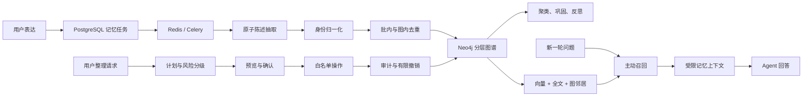

# 长期记忆模块：可治理、可追溯的记忆闭环

> 文档状态：基于 2026-08-25 的 `main` 当前实现。架构决策见 [ADR-0002](../decisions/0002-memory-identity-and-curation.md)，系统全貌见 [CURRENT-SYSTEM.md](../architecture/CURRENT-SYSTEM.md)。

## 1. 核心亮点

Meme 的记忆模块不是简单地把历史对话做向量检索，而是实现了“异步萃取、身份归一化、分层图谱、混合召回、质量治理”的长期记忆闭环。

### 简历表述

设计并实现 Meme 长期记忆闭环：将用户对话异步萃取为原子陈述、实体关系与事件，通过稳定身份锚点和分层去重控制重复及错误记忆；采用向量检索、全文检索与图关系扩展进行主动召回，并提供置信度门控、图谱校验、人工治理、操作审计和受控撤销能力，使 Agent 能持续理解用户，同时保留记忆来源和修改历史。

### 一分钟讲解

长期记忆真正困难的不是“存下来”，而是持续使用后如何避免重复、冲突和错误不断累积。Meme 在回答完成后异步处理用户表达，先抽取原子陈述，再识别实体、关系和事件；其中“我、用户、林舟、昵称”等明确指向本人的名称会先收敛到稳定的 canonical self，然后才进入普通实体去重和图谱写入。

图谱同时保留两类信息：一类是实体和关系组成的语义层，用于检索和回答；另一类是 Dialogue、Chunk、Statement 组成的溯源层，用于解释事实来自哪段原文。新一轮对话会通过向量、全文和图邻居进行混合召回，再按置信度、记忆层级和相关性过滤后注入少量上下文。对于错误记忆，系统不让模型直接执行 Cypher，而是先生成白名单操作计划，再经过预览、确认、执行和审计；普通修正可撤销，实体合并必须明确确认，合并后的自动撤销目前仍需人工处理。

这套设计覆盖了长期记忆的三个核心工程问题：如何可靠写入、如何精准召回、如何长期治理。

## 2. 为什么不能只做“历史对话向量检索”

单纯把整段对话向量化，会遇到几个问题：

- 一段话通常包含多个事实，整段命中后很难判断真正相关的是哪一句。
- “我”“用户”和真实姓名可能被建成不同人物，导致用户画像割裂。
- 向量相似只能说明文本接近，不能直接表达人物、项目、目标和事件之间的关系。
- 错误记忆一旦写入，缺少来源、审计和撤销机制时很难安全修正。
- 历史内容持续增长后，把大量召回结果直接塞进 Prompt 会增加噪声和上下文成本。

因此 Meme 将记忆设计为带来源、身份、关系、置信度和生命周期的数据，而不是一组不可治理的文本片段。

## 3. 总体架构



PostgreSQL 保存记忆任务状态和治理审计，Neo4j 保存图结构，Redis/Celery 负责异步任务。三者职责不同，因此系统采用业务层协调，而不是把所有内容强行放入同一种数据库。

## 4. 写入链路

### 4.1 为什么异步萃取

对话回答完成后，`ChatService` 先保存回复，再把本轮用户表达写入 PostgreSQL 的记忆任务表并投递 Celery。陈述抽取、三元组抽取和 Embedding 都可能调用模型，如果放在回答主链路上，会明显增加响应时间，也会让记忆服务故障直接影响聊天。

异步设计的代价是最终一致性：回答结束后，记忆不会立刻出现在图谱中，而要经历等待、萃取、完成或失败状态。当前实现通过任务状态和错误信息展示处理结果，记忆失败不会中断聊天。

### 4.2 从原文到图谱

一次萃取按以下顺序执行：

```text
原文
  → 分块
  → 原子陈述抽取
  → 实体、关系和事件抽取
  → 身份归一化
  → 实体名称向量化
  → 批内去重
  → 与已有图谱实体融合
  → 重定向 Mention、Relation、Event 边
  → Neo4j 单事务写入
  → 尝试增量社区聚类和反思触发
```

陈述被标记为事实、观点、预测或建议，并携带时间类型、重要度和置信度。实体和关系使用受控类型与谓词，避免模型每次生成完全不同的图结构。

### 4.3 为什么身份归一化必须早于普通去重

如果先做普通去重，“用户”可能是生命体，“林舟”可能被模型判断成称呼或另一个人物。由于普通去重会限制实体类型和候选范围，后面再修正就容易留下多个本人节点。

Meme 因此为每个用户建立不随姓名变化的 `self:<user_id>` 身份锚点。明确的“我叫林舟”“叫我小舟”等表达会被解析为展示名或别名，并重定向到同一个 self 实体；“我的同事林舟”“小说里的林舟”等带外部主体限定的表达不会自动绑定。无法确定时，系统宁可保留待审查状态，也不猜测身份。

### 4.4 去重不是简单字符串相等

去重分为两层：

1. 批内去重处理同一次萃取产生的重复候选。
2. 图内融合将新候选与该用户已有的活动实体比较。

候选会综合规范名称、包含关系、名称向量和受控的 LLM 判断。同名同类型实体可以快速合并，语义相近候选需要通过阈值和判断；不同类型默认不会为了减少节点数量而强行合并。合并后所有提及、关系和事件参与边都会重定向到最终实体，避免只合并节点却留下悬空关系。

## 5. 为什么图谱要区分语义层和溯源层

Meme 的基础溯源链路是：

```text
Dialogue → Chunk → Statement → Entity
```

语义关系则是：

```text
Entity → Relation → Entity
Event → Involves → Entity
Entity → Community
Insight → DerivedFrom → Entity
```

这两层不能混为一谈。实体表示“林舟”“Meme 项目”这样的概念，Statement 表示“林舟正在开发 Meme”这条原子事实，Chunk 和 Dialogue 则保存它来自哪段内容。即使几个节点显示相似文本，也承担不同职责，不能跨层级自动删除或合并。

这种结构带来的价值是：回答侧使用语义层快速找到相关事实，审查侧沿溯源层查看依据；实体整理时仍保留原始陈述和历史，不会为了让图看起来更干净而破坏证据。

## 6. 主动召回链路

### 6.1 当前什么时候召回

启用主动召回时，系统会在对话组装 System Context 时尝试提供相关记忆，并不是只在用户明确说“请回忆”时才触发。

当前使用用户级温热缓存：

- 进程内首次没有缓存时，使用当前问题同步召回一次，保证新会话第一轮也可能认识用户。
- 已有缓存时直接注入，避免阻塞首字；非寒暄问题在后台刷新缓存，供后续轮次使用。
- 召回失败、Embedding 未配置或超时，直接返回空记忆，不影响正常回答。

这个方案用“一轮以内的记忆新鲜度”换取更稳定的首字延迟。它适合用户画像这类变化相对慢的数据，但不适合要求本轮写入、本轮立即读取的强一致场景。

### 6.2 如何排序和控制噪声

实体召回组合三类信号：

- 向量相似度：处理语义相近但措辞不同的问题。
- 全文检索：保障姓名、别名、缩写和精确关键词命中。
- 实体重要度：在语义分数接近时优先保留更重要的信息。

在回答侧还会使用置信度和记忆层级计算可靠性：低于最低置信度的记忆不进入主动召回，中等置信度内容会标记为“待确认”，长期记忆在同等条件下获得轻微优先级。命中实体后只扩展有限的一跳关系，并携带关系方向、来源陈述和证据状态。

实体记忆与高层 Insight 并行检索，共享同一个问题向量；最终上下文受数量、相关度和字符上限约束。当前默认整体召回超时为 3.5 秒，上下文最多 600 个字符，避免记忆模块挤占过多 Prompt。

### 6.3 主动召回和记忆工具的区别

主动召回是系统自动提供的轻量背景，适合稳定画像和高相关事实。记忆工具则由 Agent 在确实需要时主动调用，可以执行更明确的记忆搜索。两者并存：前者保证“基本认识用户”，后者用于深入查找，避免每轮都进行重型检索。

## 7. 生命周期和治理

### 7.1 短期记忆、长期记忆和洞察

新萃取内容默认进入短期层。定时巩固任务会根据访问次数、重要度、提及次数和存在时间，将满足条件的实体及陈述提升为长期层；高频长期实体还可以汇总核心事实和特质。

反思任务从高重要度、高频实体和代表性陈述中归纳 Insight。Insight 按主题更新，并记录来源实体，不覆盖原子记忆。主动召回时，Insight 与实体事实并行检索：原子事实提供证据，高层洞察提供用户画像层面的概括。

### 7.2 如何防止模型直接改坏图谱

当前 Memory Curator 是受控规则型 Planner，不是可以自由执行 Cypher 的开放式 Agent。它只识别白名单操作，例如修改本人展示名、增加或移除别名、修正实体、合并实体和使事实失效。

治理流程包含以下保护：

- `plan` 阶段只读取目标并生成预览，不写数据。
- 操作按低、中、高风险分级，高风险必须明确确认。
- 计划包含目标快照、十分钟有效期和签名确认令牌，防止被篡改或使用过期计划。
- 执行前重新比较实体快照，目标发生变化时要求重新规划。
- 每次执行在 PostgreSQL 保存 before、after、风险、状态和时间等审计信息。
- 改名、别名和普通失效等操作可以根据快照撤销；实体合并目前不能自动撤销，需要根据审计记录人工处理。

删除和合并优先采用逻辑失效。已失效实体仍可用于审计，但不会参加新的去重和检索。

### 7.3 图谱质量校验

只读校验器可以发现：缺少或存在多个 canonical self、旧版别名实体、同名同类型活动实体、失效实体以及缺少来源证据的关系。校验只生成报告，不直接修改数据，可用于迁移前 dry-run、回归测试和后续治理建议。

历史身份迁移同样采用预览、明确目标、确认执行和幂等检查，避免根据节点名称猜测用户本人。

## 8. 关键工程取舍

### 为什么同时使用 PostgreSQL 和 Neo4j

PostgreSQL 适合保存任务状态、审计记录和事务型业务数据；Neo4j 适合表达身份、事实、事件、证据和邻居关系。拆分后查询模型更自然，但也带来跨存储最终一致性问题。

当前没有分布式事务：Neo4j 写入成功后，PostgreSQL 状态回写仍可能失败；重复执行也缺少贯穿两个存储的统一幂等键。进一步工程化可以增加 Outbox、任务幂等键、可重入恢复和对账任务。这是当前实现需要诚实说明的边界。

### 为什么不让 LLM 决定一切

LLM 擅长从非结构化文本提取候选，但不适合直接承担权限、身份唯一性和删除策略。Meme 让 LLM 负责候选陈述、关系和语义判断，把用户隔离、稳定身份、风险分级、确认令牌、审计和写入操作留给确定性代码。

### 为什么不追求把图谱合并得最小

节点少不等于质量高。跨层级合并会破坏来源，同名人物自动合并会造成身份错误，物理删除会丢失审计证据。因此系统优先保证语义正确和来源完整，再通过聚焦视图、逻辑失效和受控治理降低视觉噪声。

## 9. 当前限制与下一步

面试时主动说明边界，比把所有能力都描述成“已经完善”更可信：

- 对话自动萃取目前写入用户文本和 `auto` 来源，但没有稳定填充精确的 `source_message_id`，因此能够追溯到来源文本和图谱陈述，不一定能直接跳回某一条聊天消息。
- PostgreSQL 和 Neo4j 之间是最终一致性，没有完整的 Outbox、自动对账和跨存储幂等恢复。
- 温热缓存是进程内缓存，多实例部署时需要 Redis 缓存和版本失效机制。
- 规则型记忆整理只支持有限表达，还不是完整的自然语言记忆管家。
- 实体合并会保留审计信息，但当前不能自动撤销。
- 当前测试重点覆盖身份、治理、可靠性排序和图谱规则，还缺少稳定的线上质量指标和大规模检索评测结果。

优先级较高的后续方向是：补齐消息级来源标识，建设离线记忆评测集，记录每轮召回的候选、过滤原因和最终注入内容，再用命中率、错误召回率、矛盾率和用户纠正率衡量质量。

## 10. 高频面试问题与参考回答

### Q1：这个记忆系统和普通 RAG 有什么区别？

普通 RAG 主要回答“资料里写了什么”，数据通常来自文档；长期记忆回答“系统对这个用户持续了解什么”，数据来自用户表达、历史行为和后续纠正。Meme 不只保存文本，还保存身份、事实、关系、时间、置信度和来源，并提供生命周期和治理能力。知识库与记忆在数据边界上分离，但都可以作为 Agent 回答时的上下文来源。

### Q2：为什么不直接把所有历史对话放进向量数据库？

整段对话粒度太粗，容易一次召回大量无关内容，也无法稳定处理身份、关系和冲突。Meme 先抽取原子陈述和实体关系，用向量解决语义匹配，用全文解决精确名称，用图邻居补充关系，再沿 Statement、Chunk、Dialogue 保留证据。这样召回粒度更小，也更容易纠正某条事实。

### Q3：如何避免“我”“用户”和姓名变成多个实体？

我给每个用户建立了稳定的 `self:<user_id>` 身份键，展示名和别名只是该身份的可变属性。写图之前先执行身份解析，明确的自我声明会重定向到 canonical self；带同事、角色或作品限定的同名实体不会绑定。这样姓名变化不会改变内部身份，也不会误合并第三方人物。

### Q4：实体去重是怎么做的？为什么还需要 LLM？

去重先做批内，再与已有图谱融合。确定性部分使用规范名称、类型约束、包含关系和向量候选缩小范围；只有相似但不确定的候选才交给 LLM 判断。LLM 不直接写图，只返回同一实体判断，最终重定向和落库由代码完成。这样兼顾语义能力和可控性，也降低每对实体都调用模型的成本。

### Q5：记忆召回为什么同时使用向量和全文？

向量擅长处理“我之后想做什么”和“我的职业目标”这种语义改写，但对姓名、缩写和精确术语不一定稳定；全文检索正好补足精确命中。融合后再结合重要度、置信度和长期层级排序，并扩展一跳关系，召回结果既相关又有上下文。

### Q6：如何防止错误记忆影响回答？

写入侧记录 confidence 和来源；召回侧先做相关度门控，再过滤低置信度内容，中等置信度会明确标为待确认。治理侧支持校验、逻辑失效和人工纠正，回答上下文还要求待确认信息不能当作确定事实。当前还缺少矛盾检测和系统化线上指标，这是后续质量建设重点。

### Q7：为什么记忆萃取放在异步任务里？

萃取涉及多次 LLM、Embedding 和图数据库写入，如果放在聊天主链路，会增加首字延迟并扩大故障范围。异步任务让聊天和记忆降级解耦，代价是记忆最终一致。系统通过任务状态展示结果；进一步可以用 Outbox 和幂等键提升跨存储可靠性。

### Q8：用户说错了或要求忘记时怎么办？

系统不会让模型直接删除节点，而是把自然语言请求转换成受控操作计划。计划先解析目标、展示影响和风险，再通过签名令牌及快照校验确认执行，最后保存 before/after 审计。普通修正可以撤销，高风险合并当前只能保留审计后人工处理。删除默认使用逻辑失效，防止证据链永久丢失。

### Q9：为什么需要短期、长期和 Insight 三个层次？

新信息不应该立即和稳定画像拥有相同权重，因此新萃取先进入短期层；被多次使用、反复提及或本身重要的内容才提升为长期层。Insight 是从多条原子事实中归纳出的高层理解，它不能替代来源事实，所以单独存储并通过 `DERIVED_FROM` 保留依据。

### Q10：如果继续做，你最先改什么？

我会先建设可量化的记忆评测与召回解释：为“应该召回、不得召回、身份歧义、信息更新和矛盾事实”建立固定数据集，记录候选、分数、过滤原因和注入结果。然后补齐消息级来源、Outbox/幂等恢复和多实例缓存失效。这样优化有指标依据，而不是继续增加看起来复杂的图谱节点。

## 11. 面试演示建议

使用一条包含身份、目标和第三方实体的非敏感输入：

> 我叫林舟，正在准备 AI 应用工程岗位面试；我家的宠物叫多多。

推荐演示顺序：

1. 发送输入并查看异步记忆任务从处理中变为完成。
2. 在图谱中说明 canonical self、宠物实体以及原始 Statement 的区别。
3. 新建会话询问职业目标，展示跨会话主动召回。
4. 查看关系证据，说明召回内容如何回到来源陈述。
5. 使用改名、增加别名或失效事实的整理预览，强调高风险操作需要确认和审计。
6. 最后主动说明当前边界，例如合并不可自动撤销和跨存储最终一致性。

完整演示检查项见 [CORE-DEMO-FLOW.md](../testing/CORE-DEMO-FLOW.md)。

## 12. 实现与测试入口

| 关注点 | 代码或测试入口 |
| --- | --- |
| 对话自动派发 | [chat_service.py](../../api/app/services/chat_service.py) |
| Celery 萃取任务 | [memory.py](../../api/app/tasks/memory.py) |
| 萃取编排 | [orchestrator.py](../../api/app/core/memory/extraction/orchestrator.py) |
| 稳定身份 | [identity.py](../../api/app/core/memory/extraction/identity.py) |
| 实体去重 | [dedup.py](../../api/app/core/memory/extraction/dedup.py) |
| 图数据模型 | [graph_models.py](../../api/app/core/memory/graph_models.py) |
| 混合检索与主动召回 | [retrieval](../../api/app/core/memory/retrieval/) |
| 治理计划与执行 | [curation](../../api/app/core/memory/curation/)、[memory_curation_service.py](../../api/app/services/memory_curation_service.py) |
| 图谱校验 | [validation](../../api/app/core/memory/validation/) |
| 身份与写入回归 | [test_memory_identity_resolver.py](../../api/tests/test_memory_identity_resolver.py)、[test_memory_extraction_orchestrator.py](../../api/tests/test_memory_extraction_orchestrator.py) |
| 召回可靠性回归 | [test_memory_reliability.py](../../api/tests/test_memory_reliability.py)、[test_active_recall_prompt.py](../../api/tests/test_active_recall_prompt.py) |
| 治理与迁移回归 | [test_memory_curation_planner.py](../../api/tests/test_memory_curation_planner.py)、[test_memory_identity_migration.py](../../api/tests/test_memory_identity_migration.py) |
