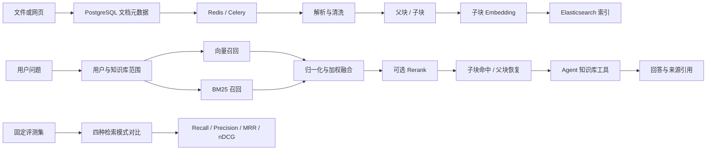

# 知识库与 RAG：从异构文档到带引用回答的可解释检索闭环

> 文档状态：基于 2026-08-26 的 `main` 当前实现。系统全貌见 [CURRENT-SYSTEM.md](../architecture/CURRENT-SYSTEM.md)，演示基线见 [CORE-DEMO-FLOW.md](../testing/CORE-DEMO-FLOW.md)。

## 1. 核心亮点

Meme 的知识库不是一个单独的“向量搜索框”，而是把资料接入、异步解析、分层切片、混合召回、上下文恢复、Agent 工具调用和来源引用串成了完整的 RAG 闭环。

### 简历表述

设计并实现 Meme 知识库 RAG 闭环：支持文件与网页异步解析、父子分块和可重试索引，基于 Elasticsearch 融合向量召回与 BM25 并支持可选 Rerank，通过 small-to-big 策略兼顾检索精度和回答上下文；实现多知识库范围控制、用户级数据隔离、来源引用与离线检索评测，使 Agent 能基于用户资料生成可追溯回答。

### 一分钟讲解

RAG 的关键矛盾是：小文本块更容易精准命中，但直接交给模型又可能缺少上下文；大文本块上下文完整，却容易降低向量表达和检索精度。Meme 因此在文档解析后同时生成父块和子块，只为子块建立向量索引。检索阶段使用向量召回理解语义，用 BM25 保留关键词和专有名词命中能力，对两路得分归一化后按权重融合，并可根据配置再做 Rerank。最终命中的是子块，但返回给 Agent 的是对应父块，同时保留实际命中的文本，供搜索界面突出显示。

整个链路还处理了真实工程问题：上传和模型调用放入异步任务，失败可重试；重试前替换旧索引，减少重复数据；每次查询强制附带用户和知识库范围；Agent 只检索启用的知识库，并把命中文档作为回答来源返回。项目还提供自建固定数据集和公开基准适配器，对不同检索策略计算 Recall、Precision、MRR、nDCG 等指标，避免只凭主观体验判断检索质量。

当前引用粒度是“来源文档级”，还没有精确到页码、段落坐标或逐句证据。这是现阶段能力边界，不应在面试中表述为完整的细粒度引用系统。

## 2. 这个模块解决了什么问题

把文档上传成功不等于完成了知识库。一个可用的 RAG 系统至少要解决以下问题：

- PDF、DOCX、Markdown、网页等输入格式不同，解析方式和失败模式也不同。
- 文本块太小会丢失上下文，太大又会降低检索精度并浪费模型上下文。
- 纯向量检索擅长语义相似，但对人名、编号和精确术语不一定稳定。
- 同一个用户可以有多个知识库，聊天不能无边界地搜索所有资料。
- 多用户共用 Elasticsearch 时，任何漏掉的过滤条件都可能造成数据越权。
- 检索到资料后，回答需要说明来源，否则用户无法判断依据是否可靠。
- 质量不能只靠“看起来能搜到”，还需要固定数据和可重复指标。

Meme 当前覆盖的是个人知识库场景：让 Agent 在明确的数据边界内检索用户资料并生成带来源回答。它不是通用搜索引擎，也暂未实现企业级文档权限树和复杂审批流程。

## 3. 总体架构



### 数据职责

| 组件 | 当前职责 |
| --- | --- |
| PostgreSQL | 文档元数据、知识库归属、解析状态、进度、标签和错误信息 |
| 文件存储 | 保存上传的原始文件，当前可使用本地存储或 OSS |
| Redis / Celery | 调度异步解析和索引任务 |
| Elasticsearch | 保存父子文本块、全文字段、向量和检索过滤字段 |
| Agent | 根据问题选择知识库工具，装配检索上下文并生成回答 |

这种拆分让关系数据、原始文件、任务状态和检索索引各自使用合适的组件。代价是系统不存在跨 PostgreSQL、文件存储和 Elasticsearch 的分布式事务，需要通过幂等、重试和补偿控制最终一致性。

## 4. 资料接入与索引链路

### 4.1 文件与网页接入

当前支持 PDF、DOCX、Markdown、TXT 和 HTML 文件，也支持导入 HTTP/HTTPS 网页。文件大小限制为 50 MB。上传时先校验用户是否拥有目标知识库；未指定知识库时使用该用户的默认知识库。

网页抓取会拒绝回环地址、私有地址、链路本地地址和保留地址，以降低服务端请求伪造风险。抓取完成后，正文同样进入文档解析任务，因此网页和本地文件复用后续索引链路。

### 4.2 为什么使用异步解析

文档解析、Embedding 和 Elasticsearch 写入都可能耗时。如果同步等待，较大文件会长时间占用请求，并把模型或搜索服务故障直接传递给上传接口。Meme 先保存原始文件和 PostgreSQL 元数据，再投递 Celery 任务；前端通过 `pending`、`parsing`、`done` 和 `failed` 状态展示进度。

失败后可以重试。重试任务在批量写入前按用户和文档删除旧块，再写入本轮结果，避免一次文档生成多套有效索引。这个过程具备业务层幂等意图，但删除和重建之间仍存在短暂窗口，不等同于数据库事务。

### 4.3 解析器的当前能力

- PDF 使用 PyMuPDF 提取页面文本。
- DOCX 提取正文段落。
- Markdown 转为 HTML 后再提取纯文本。
- HTML 会移除脚本和样式后提取正文。
- TXT 使用编码探测后解码。
- 网页正文使用 trafilatura 提取。

这些解析器适合文本型资料。扫描 PDF 没有 OCR，DOCX 表格和复杂版式也可能丢失，标题层级、页码和版面坐标目前没有完整保留。

### 4.4 父子分块

解析后的文本先按约 1024 Token 生成父块，再按约 256 Token 生成子块，子块之间保留约 10% 的句子重叠：

```text
文档
  ├─ 父块 A：完整上下文
  │    ├─ 子块 A1：参与检索与向量化
  │    ├─ 子块 A2：参与检索与向量化
  │    └─ 子块 A3：参与检索与向量化
  └─ 父块 B：完整上下文
       ├─ 子块 B1
       └─ 子块 B2
```

只有子块写入向量，父块保留正文和父子关系。这样可以减少父块向量存储，并让短查询更容易命中局部语义。当前分块以中英文句子边界和目标长度为主，还不是按 Markdown 标题、PDF 章节或语义主题自适应切分。

### 4.5 索引设计

Elasticsearch 使用统一块索引，保存：

- `user_id`、`kb_id`、`source_type` 和 `source_id`，用于隔离与过滤。
- `chunk_id`、`chunk_type` 和 `parent_id`，用于父子上下文恢复。
- `content` 和中文 IK 分词字段，用于 BM25。
- 1024 维稠密向量，用于余弦相似度检索。
- 文档名、标签和创建时间，用于展示与筛选。

当前索引按个人项目规模配置为单分片、无副本。它简化了本地部署，但不是生产集群的高可用配置。

## 5. 检索与回答链路

### 5.1 检索范围先于相似度

一次检索会先确定数据边界，再计算相关性：

1. 强制过滤当前 `user_id`。
2. 只检索聊天已启用的知识库。
3. 如果当前 Skill 指定了知识库，则进一步缩小到该知识库。
4. 根据调用场景过滤来源类型、块类型和标签。
5. 在过滤后的候选中执行向量与 BM25 召回。

这保证了“搜得准”之前先满足“只能搜哪些数据”。在多用户系统中，`user_id` 过滤是安全边界，不只是普通查询条件。

### 5.2 为什么采用混合检索

向量检索擅长语义改写，例如“如何减少重复记忆”和“记忆实体去重方案”可能表达同一意图；BM25 擅长精确关键词，例如项目名、函数名、错误码和产品编号。只保留其中一路都会产生明显盲区。

Meme 对两路候选分别做 min-max 归一化，再按当前配置融合：

```text
融合分数 = 0.6 × 向量分数 + 0.4 × BM25 分数
```

归一化是为了让不同量纲的分数可以组合。固定权重实现简单、便于解释，但并不保证适用于所有查询类型。后续可以按查询意图动态调整权重，或通过评测集训练更稳定的融合策略。

### 5.3 可选 Rerank 与降级

配置 Rerank 模型后，系统会对融合候选重新排序。Rerank 更擅长直接判断“问题与文本是否真正相关”，但会增加一次模型调用、时延和费用，因此它是可选增强，不是基础检索的强依赖。

Rerank 调用失败时，系统回退到原始融合顺序，避免知识库工具整体不可用。当前返回结果中的 `score` 仍是融合分数，而不是 Rerank 分数，因此它不能被解释为最终重排置信度。

### 5.4 small-to-big 上下文恢复

混合检索先命中子块，再根据 `parent_id` 查询对应父块：

- `matched_content` 保存真正命中的子块。
- `content` 保存交给 Agent 的父块正文。
- 如果父块缺失，则回退使用子块。

这种 small-to-big 策略让检索以小粒度保持精度，生成时又能获得更完整的上下文。全局搜索界面也利用这两个字段，在父块内容中突出命中的局部文本；如果无法精确定位，就把命中内容单独展示，避免伪造高亮位置。

### 5.5 Agent 工具与引用

知识库检索被注册为结构化 Agent 工具。模型在问题涉及已上传资料时可以调用它，工具默认取前 5 个候选，将父块内容提供给回答生成，并记录命中数和文档数。

回答引用会按 `source_id` 去重，返回来源类型、文档名称和检索分数。它能说明“回答使用了哪份文档”，但目前不包含命中块 ID、原文摘录、页码或字符区间。因此当前能力应称为来源级引用，而不是逐句证据对齐。

## 6. 质量、可靠性与安全

### 6.1 离线检索评测

项目提供独立评测目录和固定测试用户，避免读取真实用户数据。评测分为三个层级。

第一层是快速、可控的业务回归集：当前 RAG 金标集包含 10 份文档和 22 个单跳、多跳问题，并对比四种模式：

- 纯向量检索。
- 纯 BM25。
- 混合检索。
- 混合检索加 Rerank。

评测计算 Recall@5、Precision@5、MRR 和 nDCG@5：

| 指标 | 回答的问题 |
| --- | --- |
| Recall@5 | 正确来源是否进入前 5 个结果 |
| Precision@5 | 前 5 个结果中有多少是正确来源 |
| MRR | 第一个正确来源出现得有多靠前 |
| nDCG@5 | 多个相关结果的整体排序是否合理 |

第二层提供 C-MTEB T2Retrieval 适配器，用于按 nDCG@10、Recall@10 和 MRR@10 对比中文检索策略；第三层提供 HotpotQA distractor 适配器，用于观察多跳场景下的检索 Recall、答案 EM 和 F1。公开基准首次运行需要下载数据，其中 HotpotQA 可能已进入主流模型训练语料，因此只适合比较系统方案，不宜把绝对成绩解释为模型泛化能力。

仓库已经固化首轮可复核基线：自建集 10 份文档、22 个正样本中，向量、BM25 和混合检索 Recall@5 均为 1.0；但混合检索在 8 个负样本上的 NoHitAccuracy=0、FalsePositiveRate=1.0，暴露出“总会返回最近邻”的相关性门控缺口。C-MTEB 1000 corpus / 100 query 有界切片上的混合 nDCG@10=0.9728、Recall@10=0.9521，只能用于同切片策略对照，不能当官方全量榜单成绩。完整口径、逐题明细和限制见 [评测体系](EVALUATION.md) 与 [证据目录](../evaluation/evidence/2026-08-28/README.md)。

### 6.2 失败隔离与可恢复性

- 文档解析失败会记录错误信息，不会阻塞其他文档。
- 全局搜索并行查询文档、图片和记忆，单类失败不会让整个搜索失败。
- Rerank 失败会回退到混合检索结果。
- 删除文档时会清理索引、原始文件和元数据。
- 移动文档时会同步更新 PostgreSQL 归属和 Elasticsearch 的 `kb_id`。

后两项采用尽力而为的一致性处理。跨存储清理或更新失败时，理论上可能留下孤儿索引、孤儿文件或短期归属不一致，需要后续增加对账与修复任务。

### 6.3 当前安全边界

- 上传和知识库操作先校验用户归属。
- 检索查询强制带 `user_id` 和知识库范围。
- 网页导入只接受 HTTP/HTTPS，并阻止明显的内网和特殊地址。
- 评测使用固定隔离用户和独立夹具，不使用真实资料。

网页抓取对重定向目标和 DNS 重绑定仍可继续强化；如果面向公网部署，还需要增加内容类型校验、恶意文件扫描、请求体限流和更完整的出站网络策略。

## 7. 当前限制与后续改进

以下内容是已知边界，不应描述成已经完成的能力：

1. **复杂文档解析有限。** 暂无 OCR、表格结构恢复、页码坐标和版面理解；扫描 PDF 和复杂 DOCX 的召回质量可能较差。
2. **分块策略偏固定。** 当前以长度和句子边界为主，尚未按标题、章节、表格或语义变化自适应切分。
3. **聊天检索没有绝对相关性阈值。** 普通聊天路径主要返回排序靠前的候选，弱相关问题仍可能得到最近邻噪声；全局搜索另有最低向量阈值，但两条链路的语义并不完全相同。
4. **结果缺少来源级聚合。** 多个子块可能来自同一个父块或同一文档，应用检索层尚未统一去重，可能重复向 Agent 提供相似上下文。
5. **引用粒度较粗。** 当前只到来源文档，缺少页码、块 ID、原文摘录和回答句子到证据的映射。
6. **Rerank 可观测性不足。** 返回分数仍是融合分数，没有单独暴露 Rerank 分数和排序变化。
7. **跨存储是最终一致性。** PostgreSQL、文件存储和 Elasticsearch 之间没有分布式事务，删除或移动需要对账和补偿机制。
8. **评测覆盖仍有限。** 首轮报告和逐题明细已经固化，但自建集规模较小，C-MTEB 只是有顺序偏差风险的有界切片；针对解析、切片、过滤边界和生成忠实度的回归用例仍需扩充。

建议按以下顺序演进：

```text
来源去重与最低相关性门控
  → 页码 / 块坐标 / 原文摘录引用
  → 标题感知与表格感知切分
  → 跨存储对账修复任务
  → 扩充真实失败样例和在线反馈评测
```

这个顺序优先改善回答正确性和可解释性，再扩展复杂解析能力，避免先堆功能却无法证明质量。

## 8. 高频面试问题与参考回答

### Q1：请完整介绍 Meme 的 RAG 链路

**参考回答：** 用户上传文件或网页后，系统先保存原始资料和 PostgreSQL 元数据，再通过 Celery 异步解析。文本被切成父块和子块，只对子块生成 Embedding，并把父子关系、全文字段和过滤字段写入 Elasticsearch。查询时先按用户和知识库范围过滤，再分别执行向量和 BM25 召回，对分数归一化并按 0.6/0.4 融合，可选 Rerank。最后根据子块恢复父块，将完整上下文交给 Agent，同时保留命中局部和来源信息用于展示与引用。

### Q2：为什么不直接把整篇文档或固定大块做向量检索？

**参考回答：** 大块包含多个主题，向量会被平均化，短问题不容易准确命中；但只返回小块又容易缺少前后文。父子分块把两个目标拆开：子块负责精准召回，父块负责生成上下文。这不是免费收益，父块过大仍会引入噪声，父子大小需要结合评测和文档类型调整。

### Q3：为什么向量检索和 BM25 都要保留？

**参考回答：** 两者解决的问题不同。向量检索适合语义改写和同义表达，BM25 对专有名词、编号、错误码和精确关键词更稳定。Meme 先分别召回并归一化，再加权融合。这样比只使用一路稳健，但固定权重仍是启发式方案，需要通过查询分类和评测继续优化。

### Q4：两路分数为什么不能直接相加？

**参考回答：** KNN 相似度和 BM25 分数的范围、分布都不同，直接相加会让数值更大的一路主导结果。当前先对每一路候选做 min-max 归一化，再进行 0.6/0.4 融合。它简单可解释，但候选分数相同或分布异常时区分度有限，生产系统可以考虑 RRF、学习排序或基于评测的动态权重。

### Q5：已经有混合检索，为什么还需要 Rerank？

**参考回答：** 初始召回更关注高召回率，融合分数不能充分建模问题与文本的细粒度相关性。Rerank 在较小候选集上重新判断相关性，通常能改善前几名排序。但它增加模型调用和延迟，所以 Meme 将它设计为可选能力，并在失败时回退融合排序。当前还需补充 Rerank 分数和排序变化的可观测性。

### Q6：系统如何保证不会搜到其他用户的文档？

**参考回答：** 隔离不是依赖 Agent 自觉选择，而是在服务和 Elasticsearch 查询层强制携带 `user_id`。目标知识库也必须经过归属校验，聊天只使用开启了 `chat_enabled` 的知识库；如果 Skill 指定知识库，则范围进一步收窄。后续还应为所有过滤组合补充越权回归测试。

### Q7：Meme 的引用能力做到什么程度？

**参考回答：** 当前可以把检索命中的来源文档随回答返回，并在全局搜索中展示父级上下文和突出命中内容，因此具备来源级可追溯性。但它还不是严格的逐句引用：没有页码、字符区间和回答句子到证据的映射。我会把细粒度证据定位作为下一阶段重点，而不会把现在的实现包装成完整引用系统。

### Q8：异步索引如何处理失败和重复？

**参考回答：** PostgreSQL 记录 pending、parsing、done、failed 状态和错误信息，失败后可以重新投递。任务重新写入前会按用户和文档删除旧块，再批量建立本轮索引，减少重复。但 PostgreSQL、文件存储和 Elasticsearch 之间没有分布式事务，仍可能产生短时不一致，下一步应增加幂等版本号、对账扫描和补偿任务。

### Q9：你如何证明混合检索比单路检索更好？

**参考回答：** 不能只展示一个成功案例。项目用固定隔离用户、10 份文档、22 个正样本和 8 个负样本，对比向量、BM25 与混合检索，并保存代码版本、数据指纹和逐题明细。正向 Recall@5 都是 1.0，但混合检索负样本 FalsePositiveRate=1.0，说明当前优势是“能找到已有答案”，短板是“没有答案时不会停止”。C-MTEB 有界切片也显示混合在 nDCG 和 Recall 上略优于单路，但因为不是全量官方协议，我只把它用作同切片消融证据。下一步先增加相关性门控，再用相同 gold 回归验证误召回是否下降且正向 Recall 不退化。

### Q10：如果继续重构，你会优先做什么？

**参考回答：** 我会先做三个直接影响回答质量的改进：对同一来源和父块去重、为聊天检索增加可配置的最低相关性门控、把引用扩展到页码或块坐标。随后增加标题和表格感知切分、跨存储对账修复，以及基于真实反馈的评测集。优先级依据是先降低错误上下文和提升可解释性，再扩大资料类型。

## 9. 面试演示路径

建议用一份包含明确事实、专有名词和跨段关联的文档演示，避免只展示模糊的语义问答。

1. 创建一个非默认知识库并开启对话检索。
2. 上传 PDF、Markdown 或导入网页，展示异步解析状态和标签。
3. 在全局搜索中使用同义表达检索，展示父级上下文和局部命中高亮。
4. 在对话中提出必须依赖该资料的问题，展示 Agent 调用知识库和来源文档。
5. 关闭该知识库的对话开关后再次提问，说明检索范围受产品配置控制。
6. 展示自建回归集的四种检索模式和公开基准入口，说明如何判断一次策略修改是否退化。
7. 主动说明当前引用粒度和复杂文档解析限制，再给出下一阶段方案。

演示重点不是“模型回答得像人”，而是让面试官看到资料如何进入、如何被检索、为什么命中、范围如何控制，以及你如何验证质量。

## 10. 代码与验证入口

### 接入与索引

- [文档服务](../../api/app/services/document_service.py)：上传、网页导入、重试、删除、移动和预览。
- [异步解析任务](../../api/app/tasks/parse.py)：解析、父子分块、Embedding 和索引写入。
- [文档解析器](../../api/app/core/rag/parser.py)：不同文件格式的正文提取。
- [网页抓取器](../../api/app/core/rag/web_crawler.py)：网页正文提取和基础 SSRF 防护。
- [父子分块器](../../api/app/core/rag/chunker.py)：中英文句子切分和重叠策略。
- [Elasticsearch 索引](../../api/app/core/rag/es_index.py)：字段映射、全文分析器和向量定义。
- [Elasticsearch 存储](../../api/app/core/rag/es_store.py)：批量写入、删除和归属更新。

### 检索与 Agent

- [混合检索](../../api/app/core/rag/search.py)：向量、BM25、融合、Rerank 和父块恢复。
- [知识库 Agent 工具](../../api/app/core/agent/tools/builtin/knowledge.py)：结构化检索工具和来源整理。
- [聊天服务](../../api/app/services/chat_service.py)：知识库范围与工具上下文装配。
- [知识库服务](../../api/app/services/knowledge_base_service.py)：默认知识库、对话开关和数据清理。
- [全局搜索抽屉](../../web/src/components/search/SearchResultDrawer.tsx)：父级上下文展示和命中文本突出。

### 评测与演示

- [评测说明](../../api/eval/README.md)：隔离数据、运行方式和报告结构。
- [检索评测任务](../../api/eval/tasks/retrieval.py)：四种策略及指标计算。
- [检索金标集](../../api/eval/fixtures/gold/retrieval.json)：固定问题和期望来源。
- [C-MTEB T2Retrieval 适配器](../../api/eval/benchmarks/cmteb_t2/README.md)：中文检索公开基准入口。
- [HotpotQA 适配器](../../api/eval/benchmarks/hotpotqa/README.md)：多跳检索与回答评测入口。
- [核心演示清单](../testing/CORE-DEMO-FLOW.md)：上传、解析、检索和引用的人工验证步骤。

## 11. 讲解边界

面试中可以确定地说：

- 已实现多格式资料接入、异步解析、父子分块和可重试索引。
- 已实现向量与 BM25 混合检索、可选 Rerank 和父级上下文恢复。
- 已实现用户与知识库范围过滤、Agent 工具调用和来源级引用。
- 已建立隔离的离线检索评测框架，可比较四种检索策略，并提供两个公开基准适配器。

面试中不应夸大为：

- 已支持扫描件 OCR、复杂表格和版面理解。
- 已实现逐句、页码级的精确引用和事实校验。
- 已取得尚未保存、无法复核的公开基准成绩，或已证明检索效果领先。
- 已解决所有跨 PostgreSQL、文件存储和 Elasticsearch 的一致性问题。

能够准确说明这些边界，比把 Demo 描述成生产级平台更有说服力。
