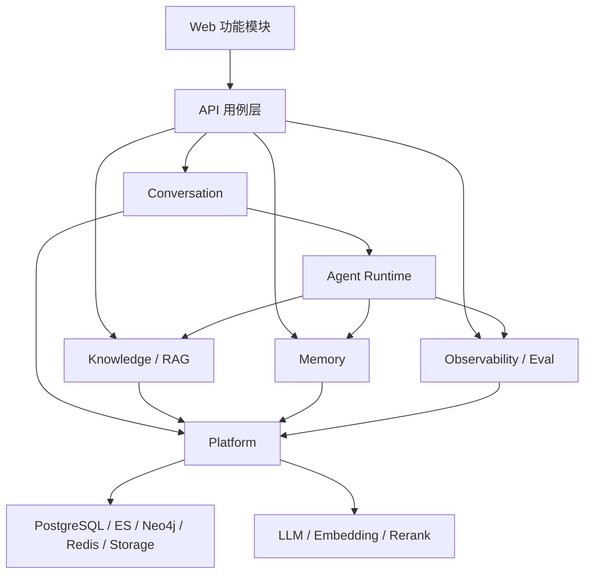

# 目标架构与实施计划

> 状态：Accepted for phased implementation
>
> 产品范围已确认；代码迁移仍按独立 Issue 和 Pull Request 分阶段实施。

## 1. 架构目标

Meme 首版继续采用模块化单体，不拆微服务。原因是当前团队规模、部署复杂度和面试演示都更适合一个 API、一个 Worker 和一个 Web 应用。

目标不是重写全部代码，而是让核心领域有清晰边界：



## 2. 目标模块边界

### 核心领域

- `auth`：身份、资料和用户隔离。
- `model_config`：模型能力、Provider 适配、密钥加密。
- `knowledge`：知识库、文档、图片入库、检索和引用。
- `conversation`：会话、消息、附件、SSE 和反馈。
- `memory`：记忆抽取、图谱、召回、审查和删除。
- `agent`：工具协议、运行循环和上下文装配，不直接拥有业务数据。
- `observability`：Trace、Token、成本和离线评测。

### 平台能力

- 数据库客户端与事务。
- Celery 队列和任务生命周期。
- 本地/OSS 文件存储。
- LLM、Embedding、Rerank、ASR 和 Web Search 适配器。
- 配置、日志、异常、安全和请求上下文。

### 可选扩展

- 定时任务作为高级能力保留，通过显式模块开关和导航策略接入。
- Research、Verifier、MCP 和 Skills 通过显式模块开关接入。
- 定时任务结果以站内历史为基础能力，不依赖外部通知渠道。
- 被隐藏或待删除的功能不得继续向核心领域增加反向依赖。

## 3. 渐进式目录方向

现有横向分层不会一次性搬迁。新代码优先按领域聚合，旧模块通过适配层逐步迁入：

```text
api/app/
  modules/
    auth/
    model_config/
    knowledge/
    conversation/
    memory/
    agent/
    observability/
  platform/
    db/
    llm/
    queue/
    storage/
  shared/

web/src/
  features/
    auth/
    knowledge/
    conversation/
    memory/
    observability/
  shared/
```

迁移规则：

1. 不做无业务价值的整仓移动。
2. 某模块发生实际重构时，才将该模块迁入新边界。
3. 每次迁移保持 API 行为兼容或提供清晰迁移说明。
4. 旧路径删除前必须完成引用扫描和测试。

## 4. 数据与基础设施策略

首版保留 PostgreSQL、Elasticsearch、Neo4j 和 Redis：

| 组件 | 保留理由 | 约束 |
| --- | --- | --- |
| PostgreSQL | 业务事实、用户隔离、事务和任务状态 | 所有业务写入具有明确事务边界 |
| Elasticsearch | 混合检索与中文全文检索 | 索引必须可由 PostgreSQL 和原文件重建 |
| Neo4j | 记忆关系、事件和可视化的差异化价值 | 图数据必须可追溯到用户和来源 |
| Redis | Celery 与短期事件总线 | 不保存唯一业务事实 |

后续若要减少部署依赖，应单独建立架构决策记录并提供性能、成本和迁移证据，不能只为了减少容器数量直接替换。

## 5. 分阶段实施

### Phase 1：建立可运行基线

- 固化环境要求和本地启动步骤。
- 验证四个存储、API、Worker 和 Web。
- 增加健康检查和最小冒烟测试。
- 建立后端 Ruff、单元测试和前端 TypeScript 构建的 CI。

验收：新环境可根据 README 启动；核心健康检查可重复通过；`main` 不接收无法运行的提交。

### Phase 2：收敛产品表面

- 根据接受的功能决策调整导航。
- 为高级或隐藏模块增加显式开关。
- 首版隐藏定时任务、Research、Verifier 和复杂标签管理入口。
- 不删除数据库和后端代码，先验证核心流程不依赖隐藏页面。
- 重写首页和首次使用引导。

验收：新用户只看到目标主线；隐藏功能不影响核心启动和构建。

### Phase 3：拆分核心耦合

- 从 ChatService 提取上下文装配、记忆召回和后台副作用。
- 明确 Agent 工具接口，Knowledge 与 Memory 通过接口接入。
- 统一异步任务状态和错误模型。
- 为核心用例补单元和集成测试。

验收：核心模块可独立测试；关闭可选模块后对话、RAG 和记忆仍可运行。

### Phase 4：删除确认的非核心功能

- 分别删除情绪、音乐、多 Agent 群聊、通知、收藏、对话公开分享和报告公开分享。
- 每个功能单独 Issue 和 PR。
- 删除通知前先保证定时任务可以独立执行并在站内查看结果。
- 先删除入口与调用，再处理 API、任务和数据表。
- 数据库只增加新迁移，不篡改历史迁移。
- 为需要保留的数据提供导出、迁移或明确放弃说明。

验收：无悬空路由、任务、环境变量、表引用和前端导入；核心回归测试通过。

### Phase 5：新增差异化能力与展示材料

- 增加召回解释、引用质量和评测面板。
- 建立可复现的 Demo 数据与演示脚本。
- 补充架构图、关键决策、性能数据和重构前后对比。
- 处理 upstream 授权后再决定是否公开仓库。

验收：十分钟内可以稳定完成完整演示，并能说明个人设计、取舍、测试与结果。

## 6. 建议拆分的后续 Issue

功能边界确认后，按以下顺序建立，而不是一个 PR 完成全部重构：

1. `chore: verify local development baseline`
2. `ci: add backend and frontend quality gates`
3. `feat: introduce product feature flags and focused navigation`
4. `refactor: decouple scheduled tasks from notification delivery`
5. `refactor: extract chat context and side effects`
6. `refactor: define knowledge and memory tool contracts`
7. `test: add core RAG and memory regression suite`
8. 针对每个已确认删除功能建立独立 Issue。
9. `docs: build interview demo and architecture narrative`

## 7. 变更治理

- `main` 保持可运行。
- 每项需求先有 Issue，再建 `agent/<description>` 分支。
- PR 默认先以 Draft 创建，完成测试和 Diff 审查后再合并。
- 代码、数据库、部署和产品范围的重大取舍写入文档。
- 每个 PR 说明“为什么改、影响谁、如何验证、如何回滚”。
